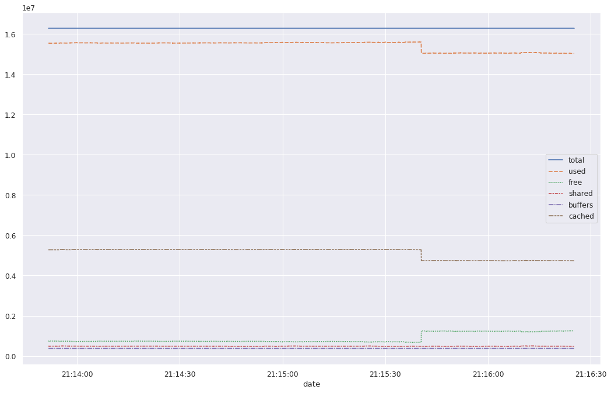

## Базовый набор тестов
Основные этапы:
1. нагрузка по объему запроса:
    1. 1 KiB
    2. 10 KiB
    3. 100 KiB
    4. 1 MiB
    5. 10 MiB
    6. 100 MiB
    7. 1 GiB
2. Нагрузка по операциям:
    1. Download
    2. Upload
    3. Удаление
    4. Переименование
    5. Копирование
        1. Сервер-Сервер
3. Нагрузка по пользователям:
    1. 1 пользователь
    2. 10 пользователя
    3. 100 пользователей
    4. 1000 пользователей
    5. 1 авторизованный пользователь + 1 неавторизованный пользователь
    6. 10 авторизованных пользователей + 10 неавторизованнх пользователей
    7. 100 авторизованных пользователей + 100 неавторизованнх пользователей
    8. 1000 авторизованных пользователей + 1000 неавторизованнх пользователей
4. Нагрузка "наплывами"
    1. 10 пользователей + наплыв из 100 пользователей
    2. 10 пользователей + наплыв из 1000 пользователей
    3. 100 пользователей + наплыв из 1000 пользователей

## Набор тестов
1. Download - Нагрузка по пользователям - Нагрузка по объему запросов
2. Upload - Нагрузка по пользователям - Нагрузка по объему запросов
3. Удаление - Нагрузка по пользователям - Нагрузка по объему запросов
4. Переименование - Нагрузка по пользователям - Нагрузка по объему запросов
5. Копирование - Нагрузка по пользователям - Нагрузка по объему запросов
6. Download - Нагрузка по пользователям - Нагрузка по объему запросов - Нагрузка "Наплывом"
7. Upload - Нагрузка по пользователям - Нагрузка по объему запросов - Нагрузка "Наплывом"

## План тестирования
1. Найти максимальное количество запросов, после которого ПО перестает отвечать на запросы (вместо базы и прочих интеграций можно использовать высокопроизводительные заглушки)
2. Проверить стабильность работы на докритичном уровне
3. Проверить стабильность на нормальном уровне на длительном периоде (1 день, 2 дня, 3 дня)
4. Проверка стабильности "Наплывами"

## Тестовый стенд
Тестовый стенд представляет из себя упакованный в Docker FTP сервер vsftpd.
Был написан Dokerfile для создания образа. В качестве основы выступает дистрибутив alpine версии 3.9.
Из прикладного ПО в образ был добавлен следующий список:
* vsftpd версии 3.0.3-r6
* python3 версии 3.6.9-r2

Написан файл конфигурации для vsftpd. Прямо в Dokerfile. FTP сервер сконфигурирован так, что анонимный(anonymous) пользователь может загружать и скачивать файлы из своей директории. Сервер "слушает" порт 9098.
Сторонние библиотеки для Python не добавлялись. Для имитации рабочего сервера был написан скрипт, добавляющей пользователей вида user_ab10 (всего 625) и генерирующий у пользователя несколько файлов:
(10*(625*1 + 625*2 + 625*1024) = 6.121397018432617 GiB)local/vsftplt                v0.3                dd6a81f77f20        2 days ago          6.63GB
Что подтверждается на практике. Для генерации файлов используется скрипт на языке Python 3, библиотека random. Для повторяемости результатов используються "зерна".
Был написан скрипт для снятия метрик - язык Python 3 + Bash. Данные сохраняются в csv формат, разделитель ";".

К сожалению Я я не смог нормально написать инструкцию CMD с двумя командами. Плюс не отработала команда:
echo \"user_$i$j$k$l:user_$i$j$k$l\" | chpasswd > /dev/null 2>&1
Поэтому к контейнеру приходится подключаться руками и исправлять ошибки. Для написана заплатка в виде Bash скрипта.


```python
import numpy as np
import pandas as pd
import matplotlib.pyplot as plt
import seaborn as sns
from sklearn.preprocessing import MinMaxScaler
```


```python
# CPU data examlpe
cpu_col_names = ['date', 'user','nice', 'system', 'iowait', 'steal', 'idle']
cpu_df = pd.read_csv('./input/veam/mon_cpu.csv', header=None, delimiter=';')
cpu_df.drop(columns=[1], inplace=True)
cpu_df.columns = cpu_col_names
cpu_df.date = pd.to_datetime(cpu_df.date)
cpu_df.head(2)
```


<div>
<style scoped>
    .dataframe tbody tr th:only-of-type {
        vertical-align: middle;
    }

    .dataframe tbody tr th {
        vertical-align: top;
    }

    .dataframe thead th {
        text-align: right;
    }
</style>
<table border="1" class="dataframe">
  <thead>
    <tr style="text-align: right;">
      <th></th>
      <th>date</th>
      <th>user</th>
      <th>nice</th>
      <th>system</th>
      <th>iowait</th>
      <th>steal</th>
      <th>idle</th>
    </tr>
  </thead>
  <tbody>
    <tr>
      <th>0</th>
      <td>2020-05-12 21:13:51.667</td>
      <td>10.55</td>
      <td>0.01</td>
      <td>6.7</td>
      <td>0.11</td>
      <td>0.0</td>
      <td>82.63</td>
    </tr>
    <tr>
      <th>1</th>
      <td>2020-05-12 21:13:51.679</td>
      <td>10.55</td>
      <td>0.01</td>
      <td>6.7</td>
      <td>0.11</td>
      <td>0.0</td>
      <td>82.63</td>
    </tr>
  </tbody>
</table>
</div>


```python
cpu_df.describe()
```


<div>
<style scoped>
    .dataframe tbody tr th:only-of-type {
        vertical-align: middle;
    }

    .dataframe tbody tr th {
        vertical-align: top;
    }

    .dataframe thead th {
        text-align: right;
    }
</style>
<table border="1" class="dataframe">
  <thead>
    <tr style="text-align: right;">
      <th></th>
      <th>user</th>
      <th>nice</th>
      <th>system</th>
      <th>iowait</th>
      <th>steal</th>
      <th>idle</th>
    </tr>
  </thead>
  <tbody>
    <tr>
      <th>count</th>
      <td>9536.00</td>
      <td>9536.00</td>
      <td>9536.000000</td>
      <td>9.536000e+03</td>
      <td>9536.0</td>
      <td>9536.000000</td>
    </tr>
    <tr>
      <th>mean</th>
      <td>10.55</td>
      <td>0.01</td>
      <td>6.704188</td>
      <td>1.100000e-01</td>
      <td>0.0</td>
      <td>82.622127</td>
    </tr>
    <tr>
      <th>std</th>
      <td>0.00</td>
      <td>0.00</td>
      <td>0.004934</td>
      <td>5.551406e-17</td>
      <td>0.0</td>
      <td>0.004092</td>
    </tr>
    <tr>
      <th>min</th>
      <td>10.55</td>
      <td>0.01</td>
      <td>6.700000</td>
      <td>1.100000e-01</td>
      <td>0.0</td>
      <td>82.620000</td>
    </tr>
    <tr>
      <th>25%</th>
      <td>10.55</td>
      <td>0.01</td>
      <td>6.700000</td>
      <td>1.100000e-01</td>
      <td>0.0</td>
      <td>82.620000</td>
    </tr>
    <tr>
      <th>50%</th>
      <td>10.55</td>
      <td>0.01</td>
      <td>6.700000</td>
      <td>1.100000e-01</td>
      <td>0.0</td>
      <td>82.620000</td>
    </tr>
    <tr>
      <th>75%</th>
      <td>10.55</td>
      <td>0.01</td>
      <td>6.710000</td>
      <td>1.100000e-01</td>
      <td>0.0</td>
      <td>82.620000</td>
    </tr>
    <tr>
      <th>max</th>
      <td>10.55</td>
      <td>0.01</td>
      <td>6.710000</td>
      <td>1.100000e-01</td>
      <td>0.0</td>
      <td>82.630000</td>
    </tr>
  </tbody>
</table>
</div>


```python
cpu_df.info()
```

    <class 'pandas.core.frame.DataFrame'>
    RangeIndex: 9538 entries, 0 to 9537
    Data columns (total 7 columns):
     #   Column  Non-Null Count  Dtype         
    ---  ------  --------------  -----         
     0   date    9538 non-null   datetime64[ns]
     1   user    9536 non-null   float64       
     2   nice    9536 non-null   float64       
     3   system  9536 non-null   float64       
     4   iowait  9536 non-null   float64       
     5   steal   9536 non-null   float64       
     6   idle    9536 non-null   float64       
    dtypes: datetime64[ns](1), float64(6)
    memory usage: 521.7 KB


```python
# disk data examlpe - need transform table
dsk_col_names = ['date', 'tps', 'kB_read_s', 'kB_wrtn_s', 'kB_read', 'kB_wrtn']
dsk_df = pd.read_csv('./input/veam/mon_disk.csv', header=None, delimiter=';')
dsk_df.drop(columns=[1], inplace=True)
dsk_df.head(2)
```


<div>
<style scoped>
    .dataframe tbody tr th:only-of-type {
        vertical-align: middle;
    }

    .dataframe tbody tr th {
        vertical-align: top;
    }

    .dataframe thead th {
        text-align: right;
    }
</style>
<table border="1" class="dataframe">
  <thead>
    <tr style="text-align: right;">
      <th></th>
      <th>0</th>
      <th>2</th>
      <th>3</th>
      <th>4</th>
      <th>5</th>
      <th>6</th>
      <th>7</th>
      <th>8</th>
      <th>9</th>
      <th>10</th>
      <th>...</th>
      <th>52</th>
      <th>53</th>
      <th>54</th>
      <th>55</th>
      <th>56</th>
      <th>57</th>
      <th>58</th>
      <th>59</th>
      <th>60</th>
      <th>61</th>
    </tr>
  </thead>
  <tbody>
    <tr>
      <th>0</th>
      <td>2020-05-12 21:13:51,665</td>
      <td>sda</td>
      <td>13.86</td>
      <td>402.3</td>
      <td>786.97</td>
      <td>231112041</td>
      <td>452094992</td>
      <td>sdb</td>
      <td>0.0</td>
      <td>0.07</td>
      <td>...</td>
      <td>0.01</td>
      <td>0.0</td>
      <td>4168</td>
      <td>0</td>
      <td>sdb8</td>
      <td>0.0</td>
      <td>0.01</td>
      <td>0.0</td>
      <td>4176</td>
      <td>0</td>
    </tr>
    <tr>
      <th>1</th>
      <td>2020-05-12 21:13:52,673</td>
      <td>sda</td>
      <td>13.86</td>
      <td>402.3</td>
      <td>786.97</td>
      <td>231112177</td>
      <td>452095096</td>
      <td>sdb</td>
      <td>0.0</td>
      <td>0.07</td>
      <td>...</td>
      <td>0.01</td>
      <td>0.0</td>
      <td>4168</td>
      <td>0</td>
      <td>sdb8</td>
      <td>0.0</td>
      <td>0.01</td>
      <td>0.0</td>
      <td>4176</td>
      <td>0</td>
    </tr>
  </tbody>
</table>
<p>2 rows × 61 columns</p>
</div>


```python
disk_dict = dict()
for i in range(0,10):
    disk_dict[dsk_df[[dsk_df.columns.to_list()[1+6*i]]].head(1).values[0][0]]=\
    dsk_df[[0]].T.append(dsk_df.T[2+6*i:7+6*i]).T
for i in disk_dict.keys():
    disk_dict[i].columns = dsk_col_names
    print(i)
    print(disk_dict[i].describe())
    print('=========================')
```

    sda
                               date     tps  kB_read_s  kB_wrtn_s    kB_read  \
    count                       153  153.00      153.0     153.00        153   
    unique                      153    1.00       11.0      17.00         23   
    top     2020-05-12 21:15:00,059   13.86      402.3     786.83  231128561   
    freq                          1  153.00       22.0      13.00         25   
    
              kB_wrtn  
    count         153  
    unique         71  
    top     452099064  
    freq            5  
    =========================
    sdb
                               date    tps  kB_read_s  kB_wrtn_s  kB_read  kB_wrtn
    count                       153  153.0     153.00      153.0      153      153
    unique                      153    1.0       1.00        1.0        1        1
    top     2020-05-12 21:15:00,059    0.0       0.07        0.0    38048        0
    freq                          1  153.0     153.00      153.0      153      153
    =========================
    sdb1
                               date    tps  kB_read_s  kB_wrtn_s  kB_read  kB_wrtn
    count                       153  153.0     153.00      153.0      153      153
    unique                      153    1.0       1.00        1.0        1        1
    top     2020-05-12 21:15:00,059    0.0       0.01        0.0     4232        0
    freq                          1  153.0     153.00      153.0      153      153
    =========================
    sdb2
                               date    tps  kB_read_s  kB_wrtn_s  kB_read  kB_wrtn
    count                       153  153.0     153.00      153.0      153      153
    unique                      153    1.0       1.00        1.0        1        1
    top     2020-05-12 21:15:00,059    0.0       0.01        0.0     4152        0
    freq                          1  153.0     153.00      153.0      153      153
    =========================
    sdb3
                               date    tps  kB_read_s  kB_wrtn_s  kB_read  kB_wrtn
    count                       153  153.0     153.00      153.0      153      153
    unique                      153    1.0       1.00        1.0        1        1
    top     2020-05-12 21:15:00,059    0.0       0.01        0.0     4160        0
    freq                          1  153.0     153.00      153.0      153      153
    =========================
    sdb4
                               date    tps  kB_read_s  kB_wrtn_s  kB_read  kB_wrtn
    count                       153  153.0     153.00      153.0      153      153
    unique                      153    1.0       1.00        1.0        1        1
    top     2020-05-12 21:15:00,059    0.0       0.01        0.0     4176        0
    freq                          1  153.0     153.00      153.0      153      153
    =========================
    sdb5
                               date    tps  kB_read_s  kB_wrtn_s  kB_read  kB_wrtn
    count                       153  153.0     153.00      153.0      153      153
    unique                      153    1.0       1.00        1.0        1        1
    top     2020-05-12 21:15:00,059    0.0       0.01        0.0     4160        0
    freq                          1  153.0     153.00      153.0      153      153
    =========================
    sdb6
                               date    tps  kB_read_s  kB_wrtn_s  kB_read  kB_wrtn
    count                       153  153.0     153.00      153.0      153      153
    unique                      153    1.0       1.00        1.0        1        1
    top     2020-05-12 21:15:00,059    0.0       0.01        0.0     4424        0
    freq                          1  153.0     153.00      153.0      153      153
    =========================
    sdb7
                               date    tps  kB_read_s  kB_wrtn_s  kB_read  kB_wrtn
    count                       153  153.0     153.00      153.0      153      153
    unique                      153    1.0       1.00        1.0        1        1
    top     2020-05-12 21:15:00,059    0.0       0.01        0.0     4168        0
    freq                          1  153.0     153.00      153.0      153      153
    =========================
    sdb8
                               date    tps  kB_read_s  kB_wrtn_s  kB_read  kB_wrtn
    count                       153  153.0     153.00      153.0      153      153
    unique                      153    1.0       1.00        1.0        1        1
    top     2020-05-12 21:15:00,059    0.0       0.01        0.0     4176        0
    freq                          1  153.0     153.00      153.0      153      153
    =========================


Bases on describe Disk dataframe (unique and freq strings) we can remove all Disk dataframe besides device sda


```python
dsk_df = disk_dict['sda']
dsk_df.date = pd.to_datetime(dsk_df.date)
del disk_dict
dsk_df.head(2)
```


<div>
<style scoped>
    .dataframe tbody tr th:only-of-type {
        vertical-align: middle;
    }

    .dataframe tbody tr th {
        vertical-align: top;
    }

    .dataframe thead th {
        text-align: right;
    }
</style>
<table border="1" class="dataframe">
  <thead>
    <tr style="text-align: right;">
      <th></th>
      <th>date</th>
      <th>tps</th>
      <th>kB_read_s</th>
      <th>kB_wrtn_s</th>
      <th>kB_read</th>
      <th>kB_wrtn</th>
    </tr>
  </thead>
  <tbody>
    <tr>
      <th>0</th>
      <td>2020-05-12 21:13:51.665</td>
      <td>13.86</td>
      <td>402.3</td>
      <td>786.97</td>
      <td>231112041</td>
      <td>452094992</td>
    </tr>
    <tr>
      <th>1</th>
      <td>2020-05-12 21:13:52.673</td>
      <td>13.86</td>
      <td>402.3</td>
      <td>786.97</td>
      <td>231112177</td>
      <td>452095096</td>
    </tr>
  </tbody>
</table>
</div>


```python
dsk_df[['tps']] = pd.Series.astype(dsk_df[['tps']], dtype=float)
dsk_df[['kB_read_s']] = pd.Series.astype(dsk_df[['kB_read_s']], dtype=float)
dsk_df[['kB_wrtn_s']] = pd.Series.astype(dsk_df[['kB_wrtn_s']], dtype=float)
dsk_df[['kB_read']] = pd.Series.astype(dsk_df[['kB_read']], dtype=float)
dsk_df[['kB_wrtn']] = pd.Series.astype(dsk_df[['kB_wrtn']], dtype=float)
```


```python
dsk_df.info()
```

    <class 'pandas.core.frame.DataFrame'>
    RangeIndex: 153 entries, 0 to 152
    Data columns (total 6 columns):
     #   Column     Non-Null Count  Dtype         
    ---  ------     --------------  -----         
     0   date       153 non-null    datetime64[ns]
     1   tps        153 non-null    object        
     2   kB_read_s  153 non-null    object        
     3   kB_wrtn_s  153 non-null    object        
     4   kB_read    153 non-null    object        
     5   kB_wrtn    153 non-null    object        
    dtypes: datetime64[ns](1), object(5)
    memory usage: 7.3+ KB


```python
dsk_df.describe()
```


<div>
<style scoped>
    .dataframe tbody tr th:only-of-type {
        vertical-align: middle;
    }

    .dataframe tbody tr th {
        vertical-align: top;
    }

    .dataframe thead th {
        text-align: right;
    }
</style>
<table border="1" class="dataframe">
  <thead>
    <tr style="text-align: right;">
      <th></th>
      <th>date</th>
      <th>tps</th>
      <th>kB_read_s</th>
      <th>kB_wrtn_s</th>
      <th>kB_read</th>
      <th>kB_wrtn</th>
    </tr>
  </thead>
  <tbody>
    <tr>
      <th>count</th>
      <td>153</td>
      <td>153.00</td>
      <td>153.0</td>
      <td>153.00</td>
      <td>153.0</td>
      <td>153.0</td>
    </tr>
    <tr>
      <th>unique</th>
      <td>153</td>
      <td>1.00</td>
      <td>11.0</td>
      <td>17.00</td>
      <td>23.0</td>
      <td>71.0</td>
    </tr>
    <tr>
      <th>top</th>
      <td>2020-05-12 21:13:58.712000</td>
      <td>13.86</td>
      <td>402.3</td>
      <td>786.83</td>
      <td>231128561.0</td>
      <td>452099064.0</td>
    </tr>
    <tr>
      <th>freq</th>
      <td>1</td>
      <td>153.00</td>
      <td>22.0</td>
      <td>13.00</td>
      <td>25.0</td>
      <td>5.0</td>
    </tr>
    <tr>
      <th>first</th>
      <td>2020-05-12 21:13:51.665000</td>
      <td>NaN</td>
      <td>NaN</td>
      <td>NaN</td>
      <td>NaN</td>
      <td>NaN</td>
    </tr>
    <tr>
      <th>last</th>
      <td>2020-05-12 21:16:24.901000</td>
      <td>NaN</td>
      <td>NaN</td>
      <td>NaN</td>
      <td>NaN</td>
      <td>NaN</td>
    </tr>
  </tbody>
</table>
</div>


```python
# memory data examlpe
mem_col_names = ['date', 'total', 'used', 'free', 'shared', 'buffers', 'cached']
swp_col_names = ['date', 'total', 'used', 'free']
mem_df = pd.read_csv('./input/veam/mon_mem.csv', header=None, delimiter=';')
mem_df = mem_df.drop(columns=[2,9])
swp_df = mem_df[[0]].T.append(mem_df.T[8:]).T
mem_df = mem_df.drop(columns=[1,10,11,12])
mem_df.columns = mem_col_names
mem_df.date = pd.to_datetime(mem_df.date)
swp_df.columns = swp_col_names
swp_df.date = pd.to_datetime(swp_df.date)
```


```python
mem_df.head(2)
```


<div>
<style scoped>
    .dataframe tbody tr th:only-of-type {
        vertical-align: middle;
    }

    .dataframe tbody tr th {
        vertical-align: top;
    }

    .dataframe thead th {
        text-align: right;
    }
</style>
<table border="1" class="dataframe">
  <thead>
    <tr style="text-align: right;">
      <th></th>
      <th>date</th>
      <th>total</th>
      <th>used</th>
      <th>free</th>
      <th>shared</th>
      <th>buffers</th>
      <th>cached</th>
    </tr>
  </thead>
  <tbody>
    <tr>
      <th>0</th>
      <td>2020-05-12 21:13:51.665</td>
      <td>16285496.0</td>
      <td>15536680.0</td>
      <td>748816.0</td>
      <td>488844.0</td>
      <td>377152.0</td>
      <td>5277708.0</td>
    </tr>
    <tr>
      <th>1</th>
      <td>2020-05-12 21:13:51.678</td>
      <td>16285496.0</td>
      <td>15537076.0</td>
      <td>748420.0</td>
      <td>488844.0</td>
      <td>377152.0</td>
      <td>5277708.0</td>
    </tr>
  </tbody>
</table>
</div>


```python
mem_df.describe()
```


<div>
<style scoped>
    .dataframe tbody tr th:only-of-type {
        vertical-align: middle;
    }

    .dataframe tbody tr th {
        vertical-align: top;
    }

    .dataframe thead th {
        text-align: right;
    }
</style>
<table border="1" class="dataframe">
  <thead>
    <tr style="text-align: right;">
      <th></th>
      <th>total</th>
      <th>used</th>
      <th>free</th>
      <th>shared</th>
      <th>buffers</th>
      <th>cached</th>
    </tr>
  </thead>
  <tbody>
    <tr>
      <th>count</th>
      <td>9796.0</td>
      <td>9.796000e+03</td>
      <td>9.796000e+03</td>
      <td>9796.000000</td>
      <td>9796.000000</td>
      <td>9.796000e+03</td>
    </tr>
    <tr>
      <th>mean</th>
      <td>16285496.0</td>
      <td>1.542516e+07</td>
      <td>8.603387e+05</td>
      <td>487637.886484</td>
      <td>377547.345039</td>
      <td>5.136833e+06</td>
    </tr>
    <tr>
      <th>std</th>
      <td>0.0</td>
      <td>2.266189e+05</td>
      <td>2.266189e+05</td>
      <td>3183.203822</td>
      <td>230.615706</td>
      <td>2.439959e+05</td>
    </tr>
    <tr>
      <th>min</th>
      <td>16285496.0</td>
      <td>1.503322e+07</td>
      <td>6.722080e+05</td>
      <td>484544.000000</td>
      <td>377152.000000</td>
      <td>4.730640e+06</td>
    </tr>
    <tr>
      <th>25%</th>
      <td>16285496.0</td>
      <td>1.508187e+07</td>
      <td>7.186560e+05</td>
      <td>485316.000000</td>
      <td>377352.000000</td>
      <td>4.742500e+06</td>
    </tr>
    <tr>
      <th>50%</th>
      <td>16285496.0</td>
      <td>1.555432e+07</td>
      <td>7.311720e+05</td>
      <td>485448.000000</td>
      <td>377520.000000</td>
      <td>5.283328e+06</td>
    </tr>
    <tr>
      <th>75%</th>
      <td>16285496.0</td>
      <td>1.556684e+07</td>
      <td>1.203624e+06</td>
      <td>488644.000000</td>
      <td>377752.000000</td>
      <td>5.285848e+06</td>
    </tr>
    <tr>
      <th>max</th>
      <td>16285496.0</td>
      <td>1.561329e+07</td>
      <td>1.252276e+06</td>
      <td>501524.000000</td>
      <td>377948.000000</td>
      <td>5.300156e+06</td>
    </tr>
  </tbody>
</table>
</div>


```python
mem_df.info()
```

    <class 'pandas.core.frame.DataFrame'>
    RangeIndex: 9799 entries, 0 to 9798
    Data columns (total 7 columns):
     #   Column   Non-Null Count  Dtype         
    ---  ------   --------------  -----         
     0   date     9799 non-null   datetime64[ns]
     1   total    9796 non-null   float64       
     2   used     9796 non-null   float64       
     3   free     9796 non-null   float64       
     4   shared   9796 non-null   float64       
     5   buffers  9796 non-null   float64       
     6   cached   9796 non-null   float64       
    dtypes: datetime64[ns](1), float64(6)
    memory usage: 536.0 KB


```python
swp_df.head(2)
```


<div>
<style scoped>
    .dataframe tbody tr th:only-of-type {
        vertical-align: middle;
    }

    .dataframe tbody tr th {
        vertical-align: top;
    }

    .dataframe thead th {
        text-align: right;
    }
</style>
<table border="1" class="dataframe">
  <thead>
    <tr style="text-align: right;">
      <th></th>
      <th>date</th>
      <th>total</th>
      <th>used</th>
      <th>free</th>
    </tr>
  </thead>
  <tbody>
    <tr>
      <th>0</th>
      <td>2020-05-12 21:13:51.665</td>
      <td>2.79194e+07</td>
      <td>4.85018e+06</td>
      <td>2.30692e+07</td>
    </tr>
    <tr>
      <th>1</th>
      <td>2020-05-12 21:13:51.678</td>
      <td>2.79194e+07</td>
      <td>4.85018e+06</td>
      <td>2.30692e+07</td>
    </tr>
  </tbody>
</table>
</div>


```python
swp_df.describe()
```


<div>
<style scoped>
    .dataframe tbody tr th:only-of-type {
        vertical-align: middle;
    }

    .dataframe tbody tr th {
        vertical-align: top;
    }

    .dataframe thead th {
        text-align: right;
    }
</style>
<table border="1" class="dataframe">
  <thead>
    <tr style="text-align: right;">
      <th></th>
      <th>date</th>
      <th>total</th>
      <th>used</th>
      <th>free</th>
    </tr>
  </thead>
  <tbody>
    <tr>
      <th>count</th>
      <td>9799</td>
      <td>9796.0</td>
      <td>9796.0</td>
      <td>9796.0</td>
    </tr>
    <tr>
      <th>unique</th>
      <td>9799</td>
      <td>1.0</td>
      <td>1.0</td>
      <td>1.0</td>
    </tr>
    <tr>
      <th>top</th>
      <td>2020-05-12 21:14:50.777000</td>
      <td>27919352.0</td>
      <td>4850176.0</td>
      <td>23069176.0</td>
    </tr>
    <tr>
      <th>freq</th>
      <td>1</td>
      <td>9796.0</td>
      <td>9796.0</td>
      <td>9796.0</td>
    </tr>
    <tr>
      <th>first</th>
      <td>2020-05-12 21:13:51.665000</td>
      <td>NaN</td>
      <td>NaN</td>
      <td>NaN</td>
    </tr>
    <tr>
      <th>last</th>
      <td>2020-05-12 21:16:25.163000</td>
      <td>NaN</td>
      <td>NaN</td>
      <td>NaN</td>
    </tr>
  </tbody>
</table>
</div>


Swap dataframe is not interesting - We ignore it in current load test report because unique quantity values in columns equal 1, e.g. block device table

```python
# network data examlpe
net_df = pd.read_csv('./input/veam/mon_network.csv', header=None, delimiter=';')
net_df.head(2)
```


<div>
<style scoped>
    .dataframe tbody tr th:only-of-type {
        vertical-align: middle;
    }

    .dataframe tbody tr th {
        vertical-align: top;
    }

    .dataframe thead th {
        text-align: right;
    }
</style>
<table border="1" class="dataframe">
  <thead>
    <tr style="text-align: right;">
      <th></th>
      <th>0</th>
      <th>1</th>
      <th>2</th>
      <th>3</th>
      <th>4</th>
      <th>5</th>
      <th>6</th>
      <th>7</th>
      <th>8</th>
    </tr>
  </thead>
  <tbody>
    <tr>
      <th>0</th>
      <td>2020-05-12 21:13:51,668</td>
      <td>mon_network</td>
      <td>eth0</td>
      <td>1502</td>
      <td>1406</td>
      <td>lo</td>
      <td>0.0</td>
      <td>0.0</td>
      <td>NaN</td>
    </tr>
    <tr>
      <th>1</th>
      <td>2020-05-12 21:13:51,782</td>
      <td>mon_network</td>
      <td>eth0</td>
      <td>1502</td>
      <td>1406</td>
      <td>lo</td>
      <td>0.0</td>
      <td>0.0</td>
      <td>NaN</td>
    </tr>
  </tbody>
</table>
</div>


```python
net_df.describe()
```


<div>
<style scoped>
    .dataframe tbody tr th:only-of-type {
        vertical-align: middle;
    }

    .dataframe tbody tr th {
        vertical-align: top;
    }

    .dataframe thead th {
        text-align: right;
    }
</style>
<table border="1" class="dataframe">
  <thead>
    <tr style="text-align: right;">
      <th></th>
      <th>3</th>
      <th>4</th>
      <th>6</th>
      <th>7</th>
      <th>8</th>
    </tr>
  </thead>
  <tbody>
    <tr>
      <th>count</th>
      <td>1371.000000</td>
      <td>1371.000000</td>
      <td>1370.0</td>
      <td>1370.0</td>
      <td>0.0</td>
    </tr>
    <tr>
      <th>mean</th>
      <td>120957.851204</td>
      <td>148929.923414</td>
      <td>0.0</td>
      <td>0.0</td>
      <td>NaN</td>
    </tr>
    <tr>
      <th>std</th>
      <td>146816.101237</td>
      <td>183250.952631</td>
      <td>0.0</td>
      <td>0.0</td>
      <td>NaN</td>
    </tr>
    <tr>
      <th>min</th>
      <td>1502.000000</td>
      <td>1406.000000</td>
      <td>0.0</td>
      <td>0.0</td>
      <td>NaN</td>
    </tr>
    <tr>
      <th>25%</th>
      <td>12300.000000</td>
      <td>13543.000000</td>
      <td>0.0</td>
      <td>0.0</td>
      <td>NaN</td>
    </tr>
    <tr>
      <th>50%</th>
      <td>38994.000000</td>
      <td>45617.000000</td>
      <td>0.0</td>
      <td>0.0</td>
      <td>NaN</td>
    </tr>
    <tr>
      <th>75%</th>
      <td>258029.000000</td>
      <td>320436.000000</td>
      <td>0.0</td>
      <td>0.0</td>
      <td>NaN</td>
    </tr>
    <tr>
      <th>max</th>
      <td>375260.000000</td>
      <td>466316.000000</td>
      <td>0.0</td>
      <td>0.0</td>
      <td>NaN</td>
    </tr>
  </tbody>
</table>
</div>


Bases on describe we can drop columns, contents loopback data

```python
net_df = net_df.drop(columns=[1,2,5,6,7,8])
net_df.columns=['date','RX', 'TX']
net_df.date = pd.to_datetime(net_df.date)
net_df.head(2)
```


<div>
<style scoped>
    .dataframe tbody tr th:only-of-type {
        vertical-align: middle;
    }

    .dataframe tbody tr th {
        vertical-align: top;
    }

    .dataframe thead th {
        text-align: right;
    }
</style>
<table border="1" class="dataframe">
  <thead>
    <tr style="text-align: right;">
      <th></th>
      <th>date</th>
      <th>RX</th>
      <th>TX</th>
    </tr>
  </thead>
  <tbody>
    <tr>
      <th>0</th>
      <td>2020-05-12 21:13:51.668</td>
      <td>1502</td>
      <td>1406</td>
    </tr>
    <tr>
      <th>1</th>
      <td>2020-05-12 21:13:51.782</td>
      <td>1502</td>
      <td>1406</td>
    </tr>
  </tbody>
</table>
</div>


```python
test_restult_df = pd.read_csv('./input/veam/result.csv')
test_restult_df.head(2)
```


<div>
<style scoped>
    .dataframe tbody tr th:only-of-type {
        vertical-align: middle;
    }

    .dataframe tbody tr th {
        vertical-align: top;
    }

    .dataframe thead th {
        text-align: right;
    }
</style>
<table border="1" class="dataframe">
  <thead>
    <tr style="text-align: right;">
      <th></th>
      <th>timeStamp</th>
      <th>elapsed</th>
      <th>label</th>
      <th>responseCode</th>
      <th>responseMessage</th>
      <th>threadName</th>
      <th>dataType</th>
      <th>success</th>
      <th>failureMessage</th>
      <th>bytes</th>
      <th>sentBytes</th>
      <th>grpThreads</th>
      <th>allThreads</th>
      <th>URL</th>
      <th>Latency</th>
      <th>IdleTime</th>
      <th>Connect</th>
    </tr>
  </thead>
  <tbody>
    <tr>
      <th>0</th>
      <td>1589318122276</td>
      <td>35</td>
      <td>File1</td>
      <td>200</td>
      <td>OK</td>
      <td>FTP Users 1-1</td>
      <td>NaN</td>
      <td>True</td>
      <td>NaN</td>
      <td>1048557</td>
      <td>0</td>
      <td>1</td>
      <td>1</td>
      <td>ftp://172.17.0.2:9098/logs/070_log.log (Ascii)...</td>
      <td>3</td>
      <td>0</td>
      <td>0</td>
    </tr>
    <tr>
      <th>1</th>
      <td>1589318122312</td>
      <td>25</td>
      <td>File2</td>
      <td>200</td>
      <td>OK</td>
      <td>FTP Users 1-1</td>
      <td>NaN</td>
      <td>True</td>
      <td>NaN</td>
      <td>1048557</td>
      <td>0</td>
      <td>1</td>
      <td>1</td>
      <td>ftp://172.17.0.2:9098/logs/210_log.log (Ascii)...</td>
      <td>1</td>
      <td>0</td>
      <td>0</td>
    </tr>
  </tbody>
</table>
</div>


```python
for i in test_restult_df.columns:
    print(test_restult_df[[i]].describe())
```

              timeStamp
    count  4.920000e+03
    mean   1.589318e+12
    std    1.006954e+04
    min    1.589318e+12
    25%    1.589318e+12
    50%    1.589318e+12
    75%    1.589318e+12
    max    1.589318e+12
               elapsed
    count  4920.000000
    mean     40.828455
    std      16.915713
    min      11.000000
    25%      29.000000
    50%      37.000000
    75%      48.000000
    max     128.000000
            label
    count    4920
    unique     10
    top     File6
    freq      492
           responseCode
    count   4920.000000
    mean     235.000000
    std      105.010672
    min      200.000000
    25%      200.000000
    50%      200.000000
    75%      200.000000
    max      550.000000
           responseMessage
    count             4920
    unique               2
    top                 OK
    freq              4428
               threadName
    count            4920
    unique              6
    top     FTP Users 1-1
    freq              820
           dataType
    count       0.0
    mean        NaN
    std         NaN
    min         NaN
    25%         NaN
    50%         NaN
    75%         NaN
    max         NaN
           success
    count     4920
    unique       2
    top       True
    freq      4428
           failureMessage
    count             0.0
    mean              NaN
    std               NaN
    min               NaN
    25%               NaN
    50%               NaN
    75%               NaN
    max               NaN
                  bytes
    count  4.920000e+03
    mean   9.437013e+05
    std    3.145991e+05
    min    0.000000e+00
    25%    1.048557e+06
    50%    1.048557e+06
    75%    1.048557e+06
    max    1.048557e+06
           sentBytes
    count     4920.0
    mean         0.0
    std          0.0
    min          0.0
    25%          0.0
    50%          0.0
    75%          0.0
    max          0.0
            grpThreads
    count  4920.000000
    mean      5.646748
    std       0.935189
    min       1.000000
    25%       6.000000
    50%       6.000000
    75%       6.000000
    max       6.000000
            allThreads
    count  4920.000000
    mean      5.646748
    std       0.935189
    min       1.000000
    25%       6.000000
    50%       6.000000
    75%       6.000000
    max       6.000000
                                                          URL
    count                                                4920
    unique                                                 10
    top     ftp://172.17.0.2:9098/logs/030_log.log (Ascii)...
    freq                                                  492
               Latency
    count  4920.000000
    mean      4.589024
    std       4.554944
    min       0.000000
    25%       1.000000
    50%       3.000000
    75%       7.000000
    max      39.000000
           IdleTime
    count    4920.0
    mean        0.0
    std         0.0
    min         0.0
    25%         0.0
    50%         0.0
    75%         0.0
    max         0.0
           Connect
    count   4920.0
    mean       0.0
    std        0.0
    min        0.0
    25%        0.0
    50%        0.0
    75%        0.0
    max        0.0

we might remove: dataType=NaN, failureMessage=NaN, IdleTime=0, Connect=0

```python

test_restult_df = test_restult_df.drop(columns=['dataType', 'failureMessage', 'IdleTime', 'Connect', 'sentBytes'])
test_restult_df.timeStamp = pd.to_datetime(test_restult_df.timeStamp, unit='ms')
test_restult_df.columns = ['date'] + test_restult_df.columns[1:].to_list()
test_restult_df.head(2)
```


<div>
<style scoped>
    .dataframe tbody tr th:only-of-type {
        vertical-align: middle;
    }

    .dataframe tbody tr th {
        vertical-align: top;
    }

    .dataframe thead th {
        text-align: right;
    }
</style>
<table border="1" class="dataframe">
  <thead>
    <tr style="text-align: right;">
      <th></th>
      <th>date</th>
      <th>elapsed</th>
      <th>label</th>
      <th>responseCode</th>
      <th>responseMessage</th>
      <th>threadName</th>
      <th>success</th>
      <th>bytes</th>
      <th>grpThreads</th>
      <th>allThreads</th>
      <th>URL</th>
      <th>Latency</th>
    </tr>
  </thead>
  <tbody>
    <tr>
      <th>0</th>
      <td>2020-05-12 21:15:22.276</td>
      <td>35</td>
      <td>File1</td>
      <td>200</td>
      <td>OK</td>
      <td>FTP Users 1-1</td>
      <td>True</td>
      <td>1048557</td>
      <td>1</td>
      <td>1</td>
      <td>ftp://172.17.0.2:9098/logs/070_log.log (Ascii)...</td>
      <td>3</td>
    </tr>
    <tr>
      <th>1</th>
      <td>2020-05-12 21:15:22.312</td>
      <td>25</td>
      <td>File2</td>
      <td>200</td>
      <td>OK</td>
      <td>FTP Users 1-1</td>
      <td>True</td>
      <td>1048557</td>
      <td>1</td>
      <td>1</td>
      <td>ftp://172.17.0.2:9098/logs/210_log.log (Ascii)...</td>
      <td>1</td>
    </tr>
  </tbody>
</table>
</div>


```python
df = test_restult_df.append(cpu_df)
df = df.append(mem_df)
df = df.append(dsk_df)
df = df.append(net_df)
```


```python
df.head(25)
```


<div>
<style scoped>
    .dataframe tbody tr th:only-of-type {
        vertical-align: middle;
    }

    .dataframe tbody tr th {
        vertical-align: top;
    }

    .dataframe thead th {
        text-align: right;
    }
</style>
<table border="1" class="dataframe">
  <thead>
    <tr style="text-align: right;">
      <th></th>
      <th>date</th>
      <th>elapsed</th>
      <th>label</th>
      <th>responseCode</th>
      <th>responseMessage</th>
      <th>threadName</th>
      <th>success</th>
      <th>bytes</th>
      <th>grpThreads</th>
      <th>allThreads</th>
      <th>...</th>
      <th>shared</th>
      <th>buffers</th>
      <th>cached</th>
      <th>tps</th>
      <th>kB_read_s</th>
      <th>kB_wrtn_s</th>
      <th>kB_read</th>
      <th>kB_wrtn</th>
      <th>RX</th>
      <th>TX</th>
    </tr>
  </thead>
  <tbody>
    <tr>
      <th>0</th>
      <td>2020-05-12 21:15:22.276</td>
      <td>35.0</td>
      <td>File1</td>
      <td>200.0</td>
      <td>OK</td>
      <td>FTP Users 1-1</td>
      <td>True</td>
      <td>1048557.0</td>
      <td>1.0</td>
      <td>1.0</td>
      <td>...</td>
      <td>NaN</td>
      <td>NaN</td>
      <td>NaN</td>
      <td>NaN</td>
      <td>NaN</td>
      <td>NaN</td>
      <td>NaN</td>
      <td>NaN</td>
      <td>NaN</td>
      <td>NaN</td>
    </tr>
    <tr>
      <th>1</th>
      <td>2020-05-12 21:15:22.312</td>
      <td>25.0</td>
      <td>File2</td>
      <td>200.0</td>
      <td>OK</td>
      <td>FTP Users 1-1</td>
      <td>True</td>
      <td>1048557.0</td>
      <td>1.0</td>
      <td>1.0</td>
      <td>...</td>
      <td>NaN</td>
      <td>NaN</td>
      <td>NaN</td>
      <td>NaN</td>
      <td>NaN</td>
      <td>NaN</td>
      <td>NaN</td>
      <td>NaN</td>
      <td>NaN</td>
      <td>NaN</td>
    </tr>
    <tr>
      <th>2</th>
      <td>2020-05-12 21:15:22.337</td>
      <td>27.0</td>
      <td>File3</td>
      <td>200.0</td>
      <td>OK</td>
      <td>FTP Users 1-1</td>
      <td>True</td>
      <td>1048557.0</td>
      <td>1.0</td>
      <td>1.0</td>
      <td>...</td>
      <td>NaN</td>
      <td>NaN</td>
      <td>NaN</td>
      <td>NaN</td>
      <td>NaN</td>
      <td>NaN</td>
      <td>NaN</td>
      <td>NaN</td>
      <td>NaN</td>
      <td>NaN</td>
    </tr>
    <tr>
      <th>3</th>
      <td>2020-05-12 21:15:22.364</td>
      <td>26.0</td>
      <td>File4</td>
      <td>200.0</td>
      <td>OK</td>
      <td>FTP Users 1-1</td>
      <td>True</td>
      <td>1048557.0</td>
      <td>1.0</td>
      <td>1.0</td>
      <td>...</td>
      <td>NaN</td>
      <td>NaN</td>
      <td>NaN</td>
      <td>NaN</td>
      <td>NaN</td>
      <td>NaN</td>
      <td>NaN</td>
      <td>NaN</td>
      <td>NaN</td>
      <td>NaN</td>
    </tr>
    <tr>
      <th>4</th>
      <td>2020-05-12 21:15:22.390</td>
      <td>29.0</td>
      <td>File5</td>
      <td>200.0</td>
      <td>OK</td>
      <td>FTP Users 1-1</td>
      <td>True</td>
      <td>1048557.0</td>
      <td>1.0</td>
      <td>1.0</td>
      <td>...</td>
      <td>NaN</td>
      <td>NaN</td>
      <td>NaN</td>
      <td>NaN</td>
      <td>NaN</td>
      <td>NaN</td>
      <td>NaN</td>
      <td>NaN</td>
      <td>NaN</td>
      <td>NaN</td>
    </tr>
    <tr>
      <th>5</th>
      <td>2020-05-12 21:15:22.419</td>
      <td>16.0</td>
      <td>File6</td>
      <td>550.0</td>
      <td>550 Failed to open file.\r\n</td>
      <td>FTP Users 1-1</td>
      <td>False</td>
      <td>0.0</td>
      <td>1.0</td>
      <td>1.0</td>
      <td>...</td>
      <td>NaN</td>
      <td>NaN</td>
      <td>NaN</td>
      <td>NaN</td>
      <td>NaN</td>
      <td>NaN</td>
      <td>NaN</td>
      <td>NaN</td>
      <td>NaN</td>
      <td>NaN</td>
    </tr>
    <tr>
      <th>6</th>
      <td>2020-05-12 21:15:22.435</td>
      <td>26.0</td>
      <td>File7</td>
      <td>200.0</td>
      <td>OK</td>
      <td>FTP Users 1-1</td>
      <td>True</td>
      <td>1048557.0</td>
      <td>1.0</td>
      <td>1.0</td>
      <td>...</td>
      <td>NaN</td>
      <td>NaN</td>
      <td>NaN</td>
      <td>NaN</td>
      <td>NaN</td>
      <td>NaN</td>
      <td>NaN</td>
      <td>NaN</td>
      <td>NaN</td>
      <td>NaN</td>
    </tr>
    <tr>
      <th>7</th>
      <td>2020-05-12 21:15:22.461</td>
      <td>24.0</td>
      <td>File8</td>
      <td>200.0</td>
      <td>OK</td>
      <td>FTP Users 1-1</td>
      <td>True</td>
      <td>1048557.0</td>
      <td>1.0</td>
      <td>1.0</td>
      <td>...</td>
      <td>NaN</td>
      <td>NaN</td>
      <td>NaN</td>
      <td>NaN</td>
      <td>NaN</td>
      <td>NaN</td>
      <td>NaN</td>
      <td>NaN</td>
      <td>NaN</td>
      <td>NaN</td>
    </tr>
    <tr>
      <th>8</th>
      <td>2020-05-12 21:15:22.485</td>
      <td>23.0</td>
      <td>File9</td>
      <td>200.0</td>
      <td>OK</td>
      <td>FTP Users 1-1</td>
      <td>True</td>
      <td>1048557.0</td>
      <td>1.0</td>
      <td>1.0</td>
      <td>...</td>
      <td>NaN</td>
      <td>NaN</td>
      <td>NaN</td>
      <td>NaN</td>
      <td>NaN</td>
      <td>NaN</td>
      <td>NaN</td>
      <td>NaN</td>
      <td>NaN</td>
      <td>NaN</td>
    </tr>
    <tr>
      <th>9</th>
      <td>2020-05-12 21:15:22.508</td>
      <td>25.0</td>
      <td>File0</td>
      <td>200.0</td>
      <td>OK</td>
      <td>FTP Users 1-1</td>
      <td>True</td>
      <td>1048557.0</td>
      <td>1.0</td>
      <td>1.0</td>
      <td>...</td>
      <td>NaN</td>
      <td>NaN</td>
      <td>NaN</td>
      <td>NaN</td>
      <td>NaN</td>
      <td>NaN</td>
      <td>NaN</td>
      <td>NaN</td>
      <td>NaN</td>
      <td>NaN</td>
    </tr>
    <tr>
      <th>10</th>
      <td>2020-05-12 21:15:22.533</td>
      <td>22.0</td>
      <td>File1</td>
      <td>200.0</td>
      <td>OK</td>
      <td>FTP Users 1-1</td>
      <td>True</td>
      <td>1048557.0</td>
      <td>1.0</td>
      <td>1.0</td>
      <td>...</td>
      <td>NaN</td>
      <td>NaN</td>
      <td>NaN</td>
      <td>NaN</td>
      <td>NaN</td>
      <td>NaN</td>
      <td>NaN</td>
      <td>NaN</td>
      <td>NaN</td>
      <td>NaN</td>
    </tr>
    <tr>
      <th>11</th>
      <td>2020-05-12 21:15:22.555</td>
      <td>21.0</td>
      <td>File2</td>
      <td>200.0</td>
      <td>OK</td>
      <td>FTP Users 1-1</td>
      <td>True</td>
      <td>1048557.0</td>
      <td>1.0</td>
      <td>1.0</td>
      <td>...</td>
      <td>NaN</td>
      <td>NaN</td>
      <td>NaN</td>
      <td>NaN</td>
      <td>NaN</td>
      <td>NaN</td>
      <td>NaN</td>
      <td>NaN</td>
      <td>NaN</td>
      <td>NaN</td>
    </tr>
    <tr>
      <th>12</th>
      <td>2020-05-12 21:15:22.576</td>
      <td>23.0</td>
      <td>File3</td>
      <td>200.0</td>
      <td>OK</td>
      <td>FTP Users 1-1</td>
      <td>True</td>
      <td>1048557.0</td>
      <td>1.0</td>
      <td>1.0</td>
      <td>...</td>
      <td>NaN</td>
      <td>NaN</td>
      <td>NaN</td>
      <td>NaN</td>
      <td>NaN</td>
      <td>NaN</td>
      <td>NaN</td>
      <td>NaN</td>
      <td>NaN</td>
      <td>NaN</td>
    </tr>
    <tr>
      <th>13</th>
      <td>2020-05-12 21:15:22.599</td>
      <td>22.0</td>
      <td>File4</td>
      <td>200.0</td>
      <td>OK</td>
      <td>FTP Users 1-1</td>
      <td>True</td>
      <td>1048557.0</td>
      <td>1.0</td>
      <td>1.0</td>
      <td>...</td>
      <td>NaN</td>
      <td>NaN</td>
      <td>NaN</td>
      <td>NaN</td>
      <td>NaN</td>
      <td>NaN</td>
      <td>NaN</td>
      <td>NaN</td>
      <td>NaN</td>
      <td>NaN</td>
    </tr>
    <tr>
      <th>14</th>
      <td>2020-05-12 21:15:22.621</td>
      <td>21.0</td>
      <td>File5</td>
      <td>200.0</td>
      <td>OK</td>
      <td>FTP Users 1-1</td>
      <td>True</td>
      <td>1048557.0</td>
      <td>1.0</td>
      <td>1.0</td>
      <td>...</td>
      <td>NaN</td>
      <td>NaN</td>
      <td>NaN</td>
      <td>NaN</td>
      <td>NaN</td>
      <td>NaN</td>
      <td>NaN</td>
      <td>NaN</td>
      <td>NaN</td>
      <td>NaN</td>
    </tr>
    <tr>
      <th>15</th>
      <td>2020-05-12 21:15:22.642</td>
      <td>12.0</td>
      <td>File6</td>
      <td>550.0</td>
      <td>550 Failed to open file.\r\n</td>
      <td>FTP Users 1-1</td>
      <td>False</td>
      <td>0.0</td>
      <td>1.0</td>
      <td>1.0</td>
      <td>...</td>
      <td>NaN</td>
      <td>NaN</td>
      <td>NaN</td>
      <td>NaN</td>
      <td>NaN</td>
      <td>NaN</td>
      <td>NaN</td>
      <td>NaN</td>
      <td>NaN</td>
      <td>NaN</td>
    </tr>
    <tr>
      <th>16</th>
      <td>2020-05-12 21:15:22.654</td>
      <td>21.0</td>
      <td>File7</td>
      <td>200.0</td>
      <td>OK</td>
      <td>FTP Users 1-1</td>
      <td>True</td>
      <td>1048557.0</td>
      <td>1.0</td>
      <td>1.0</td>
      <td>...</td>
      <td>NaN</td>
      <td>NaN</td>
      <td>NaN</td>
      <td>NaN</td>
      <td>NaN</td>
      <td>NaN</td>
      <td>NaN</td>
      <td>NaN</td>
      <td>NaN</td>
      <td>NaN</td>
    </tr>
    <tr>
      <th>17</th>
      <td>2020-05-12 21:15:22.675</td>
      <td>23.0</td>
      <td>File8</td>
      <td>200.0</td>
      <td>OK</td>
      <td>FTP Users 1-1</td>
      <td>True</td>
      <td>1048557.0</td>
      <td>1.0</td>
      <td>1.0</td>
      <td>...</td>
      <td>NaN</td>
      <td>NaN</td>
      <td>NaN</td>
      <td>NaN</td>
      <td>NaN</td>
      <td>NaN</td>
      <td>NaN</td>
      <td>NaN</td>
      <td>NaN</td>
      <td>NaN</td>
    </tr>
    <tr>
      <th>18</th>
      <td>2020-05-12 21:15:22.698</td>
      <td>23.0</td>
      <td>File9</td>
      <td>200.0</td>
      <td>OK</td>
      <td>FTP Users 1-1</td>
      <td>True</td>
      <td>1048557.0</td>
      <td>1.0</td>
      <td>1.0</td>
      <td>...</td>
      <td>NaN</td>
      <td>NaN</td>
      <td>NaN</td>
      <td>NaN</td>
      <td>NaN</td>
      <td>NaN</td>
      <td>NaN</td>
      <td>NaN</td>
      <td>NaN</td>
      <td>NaN</td>
    </tr>
    <tr>
      <th>19</th>
      <td>2020-05-12 21:15:22.721</td>
      <td>22.0</td>
      <td>File0</td>
      <td>200.0</td>
      <td>OK</td>
      <td>FTP Users 1-1</td>
      <td>True</td>
      <td>1048557.0</td>
      <td>1.0</td>
      <td>1.0</td>
      <td>...</td>
      <td>NaN</td>
      <td>NaN</td>
      <td>NaN</td>
      <td>NaN</td>
      <td>NaN</td>
      <td>NaN</td>
      <td>NaN</td>
      <td>NaN</td>
      <td>NaN</td>
      <td>NaN</td>
    </tr>
    <tr>
      <th>20</th>
      <td>2020-05-12 21:15:22.743</td>
      <td>23.0</td>
      <td>File1</td>
      <td>200.0</td>
      <td>OK</td>
      <td>FTP Users 1-1</td>
      <td>True</td>
      <td>1048557.0</td>
      <td>1.0</td>
      <td>1.0</td>
      <td>...</td>
      <td>NaN</td>
      <td>NaN</td>
      <td>NaN</td>
      <td>NaN</td>
      <td>NaN</td>
      <td>NaN</td>
      <td>NaN</td>
      <td>NaN</td>
      <td>NaN</td>
      <td>NaN</td>
    </tr>
    <tr>
      <th>21</th>
      <td>2020-05-12 21:15:22.771</td>
      <td>26.0</td>
      <td>File2</td>
      <td>200.0</td>
      <td>OK</td>
      <td>FTP Users 1-1</td>
      <td>True</td>
      <td>1048557.0</td>
      <td>1.0</td>
      <td>1.0</td>
      <td>...</td>
      <td>NaN</td>
      <td>NaN</td>
      <td>NaN</td>
      <td>NaN</td>
      <td>NaN</td>
      <td>NaN</td>
      <td>NaN</td>
      <td>NaN</td>
      <td>NaN</td>
      <td>NaN</td>
    </tr>
    <tr>
      <th>22</th>
      <td>2020-05-12 21:15:22.797</td>
      <td>22.0</td>
      <td>File3</td>
      <td>200.0</td>
      <td>OK</td>
      <td>FTP Users 1-1</td>
      <td>True</td>
      <td>1048557.0</td>
      <td>1.0</td>
      <td>1.0</td>
      <td>...</td>
      <td>NaN</td>
      <td>NaN</td>
      <td>NaN</td>
      <td>NaN</td>
      <td>NaN</td>
      <td>NaN</td>
      <td>NaN</td>
      <td>NaN</td>
      <td>NaN</td>
      <td>NaN</td>
    </tr>
    <tr>
      <th>23</th>
      <td>2020-05-12 21:15:22.819</td>
      <td>22.0</td>
      <td>File4</td>
      <td>200.0</td>
      <td>OK</td>
      <td>FTP Users 1-1</td>
      <td>True</td>
      <td>1048557.0</td>
      <td>1.0</td>
      <td>1.0</td>
      <td>...</td>
      <td>NaN</td>
      <td>NaN</td>
      <td>NaN</td>
      <td>NaN</td>
      <td>NaN</td>
      <td>NaN</td>
      <td>NaN</td>
      <td>NaN</td>
      <td>NaN</td>
      <td>NaN</td>
    </tr>
    <tr>
      <th>24</th>
      <td>2020-05-12 21:15:22.841</td>
      <td>25.0</td>
      <td>File5</td>
      <td>200.0</td>
      <td>OK</td>
      <td>FTP Users 1-1</td>
      <td>True</td>
      <td>1048557.0</td>
      <td>1.0</td>
      <td>1.0</td>
      <td>...</td>
      <td>NaN</td>
      <td>NaN</td>
      <td>NaN</td>
      <td>NaN</td>
      <td>NaN</td>
      <td>NaN</td>
      <td>NaN</td>
      <td>NaN</td>
      <td>NaN</td>
      <td>NaN</td>
    </tr>
  </tbody>
</table>
<p>25 rows × 31 columns</p>
</div>


## Visualization


```python
df = df.set_index(df.date, drop=True)
```


```python
df.drop(columns=['date'], inplace=True)
```


```python
df = df.sort_index()
```


```python
df.index
```


    DatetimeIndex(['2020-05-12 21:13:51.665000', '2020-05-12 21:13:51.665000',
                   '2020-05-12 21:13:51.667000', '2020-05-12 21:13:51.668000',
                   '2020-05-12 21:13:51.678000', '2020-05-12 21:13:51.679000',
                   '2020-05-12 21:13:51.692000', '2020-05-12 21:13:51.704000',
                   '2020-05-12 21:13:51.707000', '2020-05-12 21:13:51.716000',
                   ...
                   '2020-05-12 21:16:25.099000', '2020-05-12 21:16:25.116000',
                   '2020-05-12 21:16:25.116000', '2020-05-12 21:16:25.132000',
                   '2020-05-12 21:16:25.132000', '2020-05-12 21:16:25.147000',
                   '2020-05-12 21:16:25.149000', '2020-05-12 21:16:25.163000',
                   '2020-05-12 21:16:25.166000', '2020-05-12 21:16:25.166000'],
                  dtype='datetime64[ns]', name='date', length=25781, freq=None)


```python
sns.set(style='darkgrid')
plt.figure(figsize=(16,10), dpi= 80)
sns.catplot(data=test_restult_df, x='label', y='responseCode', kind='bar')
```


    <seaborn.axisgrid.FacetGrid at 0x7f26a9f00190>


    <Figure size 1280x800 with 0 Axes>


```python
df.columns
```


    Index(['elapsed', 'label', 'responseCode', 'responseMessage', 'threadName',
           'success', 'bytes', 'grpThreads', 'allThreads', 'URL', 'Latency',
           'user', 'nice', 'system', 'iowait', 'steal', 'idle', 'total', 'used',
           'free', 'shared', 'buffers', 'cached', 'tps', 'kB_read_s', 'kB_wrtn_s',
           'kB_read', 'kB_wrtn', 'RX', 'TX'],
          dtype='object')


It's wrong! We need scale our data! CPU data already scaled - we need exclude it


```python
df.info()
```

    <class 'pandas.core.frame.DataFrame'>
    DatetimeIndex: 25781 entries, 2020-05-12 21:13:51.665000 to 2020-05-12 21:16:25.166000
    Data columns (total 30 columns):
     #   Column           Non-Null Count  Dtype  
    ---  ------           --------------  -----  
     0   elapsed          4920 non-null   float64
     1   label            4920 non-null   object 
     2   responseCode     4920 non-null   float64
     3   responseMessage  4920 non-null   object 
     4   threadName       4920 non-null   object 
     5   success          4920 non-null   object 
     6   bytes            4920 non-null   float64
     7   grpThreads       4920 non-null   float64
     8   allThreads       4920 non-null   float64
     9   URL              4920 non-null   object 
     10  Latency          4920 non-null   float64
     11  user             9536 non-null   float64
     12  nice             9536 non-null   float64
     13  system           9536 non-null   float64
     14  iowait           9536 non-null   float64
     15  steal            9536 non-null   float64
     16  idle             9536 non-null   float64
     17  total            9796 non-null   float64
     18  used             9796 non-null   float64
     19  free             9796 non-null   float64
     20  shared           9796 non-null   float64
     21  buffers          9796 non-null   float64
     22  cached           9796 non-null   float64
     23  tps              153 non-null    object 
     24  kB_read_s        153 non-null    object 
     25  kB_wrtn_s        153 non-null    object 
     26  kB_read          153 non-null    object 
     27  kB_wrtn          153 non-null    object 
     28  RX               1371 non-null   float64
     29  TX               1371 non-null   float64
    dtypes: float64(20), object(10)
    memory usage: 6.1+ MB


```python
scaler=MinMaxScaler()
```


```python
scaled_df = df
col_to_scale = ['bytes', 'Latency', 'total', 'used', 'free', 'shared', 'buffers', 'cached',
       'tps', 'kB_read_s', 'kB_wrtn_s', 'kB_read', 'kB_wrtn', 'RX', 'TX']
for i in col_to_scale:
    scaled_df[[i]] = scaler.fit_transform(df[[i]])
    scaled_df[[i]] = scaled_df[[i]]*100

```


```python
dash_styles = ["",
               (4, 1.5),
               (1, 1),
               (3, 1, 1.5, 1),
               (5, 1, 1, 1),
               (5, 1, 2, 1, 2, 1),plt.figure(figsize=(16,10), dpi= 80)
               (2, 2, 3, 1.5),
               (1, 2.5, 3, 1.2),
               (1, 3, 3, 1.2),
               (2, 2, 3, 1.5),
               (2, 2.5, 3, 1.2),
               (2, 3, 3, 1.2)]
plt.figure(figsize=(16,10), dpi= 80)
sns.set(style='darkgrid')
sns.lineplot(data=scaled_df[['Latency',
                             'user', 
                             'nice', 
                             'system', 
                             'used',  
                             'RX', 
                             'TX', 
                             'kB_read_s', 
                             'kB_wrtn_s', 
                             'kB_read', 
                             'kB_wrtn',]]
#             , style=Trueplt.figure(figsize=(16,10), dpi= 80)
#             , markers=filled_markers
            , dashes=dash_styles,)
```


    <matplotlib.axes._subplots.AxesSubplot at 0x7f26b5d06fd0>


we need cut off piece from 21:15:25 to 21:16:10


```python
n_scaled_df = scaled_df[(df.index >= pd.to_datetime('2020-05-12 21:15:20.000000')) & 
                        (df.index <= pd.to_datetime('2020-05-12 21:16:00.000000'))]
```


```python
filled_markers = ('o', 'v', '^', '<', '>', '8', 's', 'p', '*', 'h', 'H', 'D', 'd', 'P', 'X')
dash_styles = ["",
               (4, 1.5),
               (1, 1),
               (3, 1, 1.5, 1),
               (5, 1, 1, 1),
               (5, 1, 2, 1, 2, 1),
               (2, 2, 3, 1.5),
               (1, 2.5, 3, 1.2),
               (1, 3, 3, 1.2),
               (2, 2, 3, 1.5),
               (2, 2.5, 3, 1.2),
               (2, 3, 3, 1.2)]
plt.figure(figsize=(16,10), dpi= 80)
sns.set(style='darkgrid')
sns.lineplot(data=n_scaled_df[['Latency',
                             'user', 
                             'nice', 
                             'system', 
                             'used',  
                             'RX', 
                             'TX', 
                             'kB_read_s', 
                             'kB_wrtn_s', 
                             'kB_read', 
                             'kB_wrtn',]]
#             , style=Trueplt.figure(figsize=(16,10), dpi= 80)
#             , markers=filled_markers
            , dashes=dash_styles,)
```


    <matplotlib.axes._subplots.AxesSubplot at 0x7f26b63251d0>


It's strange... Ok, let's view plot before append!


```python
mem_df = mem_df.set_index(mem_df.date).drop(columns=['date'])
```


```python
plt.figure(figsize=(16,10), dpi= 80)
sns.set(style='darkgrid')
sns.lineplot(data=mem_df)
```


    <matplotlib.axes._subplots.AxesSubplot at 0x7f26aad81550>





```python
dsk_df = dsk_df.set_index(dsk_df.date).drop(columns=['date'])
dsk_df.head(2)
```


<div>
<style scoped>
    .dataframe tbody tr th:only-of-type {
        vertical-align: middle;
    }

    .dataframe tbody tr th {
        vertical-align: top;
    }

    .dataframe thead th {
        text-align: right;
    }
</style>
<table border="1" class="dataframe">
  <thead>
    <tr style="text-align: right;">
      <th></th>
      <th>tps</th>
      <th>kB_read_s</th>
      <th>kB_wrtn_s</th>
      <th>kB_read</th>
      <th>kB_wrtn</th>
    </tr>
    <tr>
      <th>date</th>
      <th></th>
      <th></th>
      <th></th>
      <th></th>
      <th></th>
    </tr>
  </thead>
  <tbody>
    <tr>
      <th>2020-05-12 21:13:51.665</th>
      <td>13.86</td>
      <td>402.3</td>
      <td>786.97</td>
      <td>231112041</td>
      <td>452094992</td>
    </tr>
    <tr>
      <th>2020-05-12 21:13:52.673</th>
      <td>13.86</td>
      <td>402.3</td>
      <td>786.97</td>
      <td>231112177</td>
      <td>452095096</td>
    </tr>
  </tbody>
</table>
</div>


```python
dsk_df.info()
```

    <class 'pandas.core.frame.DataFrame'>
    DatetimeIndex: 153 entries, 2020-05-12 21:13:51.665000 to 2020-05-12 21:16:24.901000
    Data columns (total 5 columns):
     #   Column     Non-Null Count  Dtype  
    ---  ------     --------------  -----  
     0   tps        153 non-null    float64
     1   kB_read_s  153 non-null    float64
     2   kB_wrtn_s  153 non-null    float64
     3   kB_read    153 non-null    float64
     4   kB_wrtn    153 non-null    float64
    dtypes: float64(5)
    memory usage: 7.2 KB


```python
plt.figure(figsize=(16,10), dpi= 80)
sns.set(style='darkgrid')
sns.lineplot(data=dsk_df)
```


    <matplotlib.axes._subplots.AxesSubplot at 0x7f26a9f82550>


Графики выглядят нормально. Возможно что-либо было выгружено из памяти или был завершен какой-то тяжелый процесс.
Вообще запускать генератор нагрузки и тестируемую программу на одной машине неправильно.
Тест прошол очень стабильно, однако в середине теста выросла задержка(Latency), что можно объяснить большим количеством тредов использующих сеть.
Тестирование софта - увлекательный процесс. То, что сделано в данной работе - лишь моё мнение, и Я использовал для создания стенда максимально доступные инструменты - Jupiter Notebook с пакетами pandas, numpy, pyplot(matplotlib), seaborn, sklearn. Зонды были поставлены на основные компоненты: CPU, network, RAM, HDD, однако Я ограничился лишь отсутствием времени и небольшим опытом использования специализированных утилит. Среди которых можно выделить Micro Focus Dynamic с неинвазивным мониторингом ПО, написанном на .NET, Python, Java и многих других языках.
APM от Elastic с неинвазивным мониторингом ПО, написанном на Java, Go, Node.js, Python, Ruby, .NET (с которым Я кстати имел дело).
Вместе с этим имеется Splunk, но он недоступен на российском рынке.

В качестве генератора нагрузки был использован ставший стандартом де-факто Apache Jmeter, однако существует еще много разлиного ПО для этого (например Yandex.Tank с генераторами Phantom, Jmeter, BFG, Pandora). Если объектом теста является http сервер, то на первых парах можно использовать Soap UI
